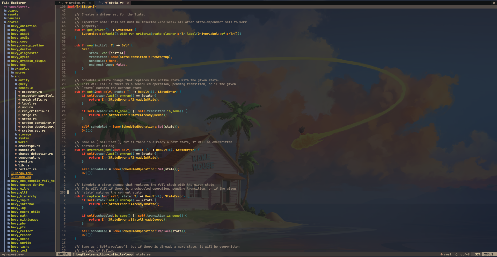

# neovim-flake

⚠️ **This is no longer being maintained. My configuration has moved [here](https://github.com/siph/nixvim-flake).** ⚠️

Configurable nix-based neovim distribution with built-in LSP, syntax
highlighting, buffer tabs, debugger, and more.

## Screenshot

## Credits
Forked from jordanisaacs'
[neovim-flake](https://github.com/jordanisaacs/neovim-flake)
